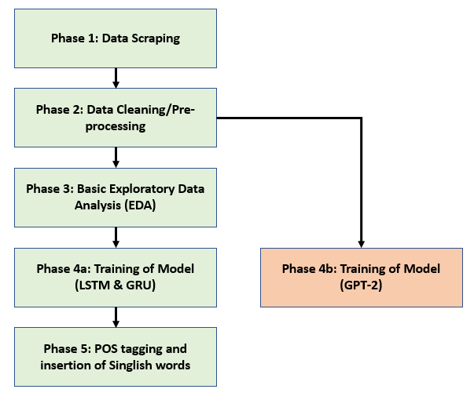

# Next "Singlish" Sentence Generator

_A Natural Language Generation (NLG) project done for CE/CZ4042 Neural Network and Deep Learning group project in Nanyang Technological University (NTU)._   

### Brief introduction to our project 
In this project, we will be focusing on natural language generation (NLG) problems in the Singapore context. Mainly, we will be focusing on how we can generate sentences from a corpus with Singapore context in it. Then, we will do some hand engineering on the generated text by including the most common Singlish words used in Singapore with the help of POS (part-of-speech) tagging.   

### What is NLG?
NLG is a subsection of Natural Language Processing (NLP). NLG software turns structured data into written narrative, writing like a human being. NLG makes data universally understandable and seeks to automate the writing of data-driven narratives like financial reports, product descriptions, meeting memos, and more.   

### Limitations of the current NLG models available
There are many implementations related to sentence generation on the internet. However, most of them were trained with default datasets, such as Shakespeare’s “sonnets.txt”, or ready-made twitter dataset. From the current implementations available, there are only very few datasets available online that are in the Singapore context, particularly, Singapore text data with some singlish context in it. There was one suitable corpus that we could use for this project which is the Singapore Short Message Service (SMS) corpus from the National University of Singapore (NUS). However, there were only 35,598 english SMSes, with only a limited number of unique tokens available, resulting in our text generation not being diverse if we were to use this corpus. This gives us the motivation to scrape our own Singapore dataset with some essence of Singlish inside.   

### Aim of our project: The Next “Singlish” Sentence Generator
Our project aims to generate coherent sentences given a particular start words, phrases or sentences, based on the various models trained with our scraped text corpus. We hope that the sentences generated will have Singapore sentiments and also some traces of Singlish. We break our project into 5 phases, from the start with data scraping to the last phase with POS tagging of Singlish words to the generated sentences.   

### Project Pipeline: Overview   
Our project pipeline is as shown below.   
   

### Project Phases: How it is executed in each phase   
**These are the brief explanations of how these phases were implemented:**  

**Phase 1: Data Scraping**   
To do web scraping of texts from Singapore Facebook pages’ posts.  

**Phase 2: Data Cleaning/Pre-processing**   
To combine the individual scraped .xlsx file into one big data file, then do data cleaning using regular expression (regex) and save the ‘cleaner’ data as SgCorpus.txt for the next phase.   

**Phase 3: Basic Exploratory Data Analysis (EDA)**   
To perform some simple data analysis like term frequency–inverse document frequency (tfidf) and WordCloud for visualisation.   

**Phase 4a: Training of Model (LSTM & GRU)**   
To build a few models using the text corpus we have scraped and cleaned in Phase 1 and Phase 2 respectively to analyse which model can generate the most coherent sentences.   

**Phase 5: POS tagging and insertion of Singlish words**   
To perform some hand engineering on the generated text and insertion of singlish words.   

**BONUS - Phase 4b: Training of Model (GPT-2)**   
To fine-tune the GPT-2 (small version) in Google Colaboratory such that we are able to train our model using the corpus we have scraped, and generate the sentence based on a given start string of words.   

### Libraries/modules used in this project

**Phase 1: Data Scraping**  
- xlsxwriter  
- facebook_scraper (get_posts)   

**Phase 2: Data Cleaning/Pre-processing**  
- pandas  
- os  
- requests  
- urllib  
- xlrd  
- re  

**Phase 3: Basic Exploratory Data Analysis**  
- wordcloud (WordCloud, ImageColorGenerator)  
- matplotlib.pyplot  
- pandas  
- string  
- PIL (Image)  
- numpy  
- os  
- itertools (islice)  
- sklearn.feature_extraction.text (CountVectorizer, TfidfTransformer)  

**Phase 4a: Training of Model (LSTM & GRU)**  
- numpy  
- string  
- tensorflow   
- time  

**Phase 4b: Training of Model (Attention: GPT-2)**  
- gpt_2_simple  
- datetime  

**Phase 5: POS tagging and insertion of Singlish words**  
- nltk  
- string  
- tensorflow  
- random  

**Coded in**  
- Python

**Software used**  
- Spyder & Visual Studio Code IDE - Phase 1   
- Jupyter Notebook - Phase 2   
- Google Colaboratory (GPU instance) - Phase 3, 4a & 4b, 5   

### Files included in this project (File Structure) 
- Project_Report.pdf   
- Phase1-FBScraper.py  
- Phase2-data-pre-processing.ipynb  
- Phase3-EDA.ipynb
- Phase4a-next-sentence-generator.ipynb
- Phase4b-next-sentence-generator-gpt2.ipynb
- Phase5-POS-insertion-Singlish-words.ipynb
- finalData/
  - SgCorpus.txt
- saved_weights/
  - 2LAYER_GRU-100_epoch-64_batch_size-Adam.csv
  - 2LAYER_GRU-100_epoch-64_batch_size-Adam.h5
  - 2LAYER_GRU-100_epoch-64_batch_size-RMSprop.csv
  - 2LAYER_GRU-100_epoch-64_batch_size-RMSprop.h5
  - 2LAYER_GRU-100_epoch-128_batch_size-Adam.csv
  - 2LAYER_GRU-100_epoch-128_batch_size-Adam.h5
  - 2LAYER_GRU-100_epoch-128_batch_size-RMSprop.csv
  - 2LAYER_GRU-100_epoch-128_batch_size-RMSprop.h5
  - 2LAYER_LSTM-1_epoch-128_batch_size-Adam.csv
  - 2LAYER_LSTM-1_epoch-128_batch_size-Adam.h5
  - 2LAYER_LSTM-20_epoch-128_batch_size-Adam.csv
  - 2LAYER_LSTM-20_epoch-128_batch_size-Adam.h5
  - 2LAYER_LSTM-20_epoch-128_batch_size-SGD.csv
  - 2LAYER_LSTM-20_epoch-128_batch_size-SGD.h5
  - 2LAYER_LSTM-100_epoch-64_batch_size-Adam.csv
  - 2LAYER_LSTM-100_epoch-64_batch_size-Adam.h5
  - 2LAYER_LSTM-100_epoch-64_batch_size-RMSprop.csv
  - 2LAYER_LSTM-100_epoch-64_batch_size-RMSprop.h5
  - 2LAYER_LSTM-100_epoch-128_batch_size-Adam.csv
  - 2LAYER_LSTM-100_epoch-128_batch_size-Adam.h5
  - 2LAYER_LSTM-100_epoch-128_batch_size-RMSprop.csv
  - 2LAYER_LSTM-100_epoch-128_batch_size-RMSprop.h5  
- scrapedData/
  - scrapingData_ACJC-Confessions-365341810240423_FULL.xlsx
  - scrapingData_andiechen_FULL.xlsx
  - scrapingData_asrjcconfessions_FULL.xlsx
  - scrapingData_bellywellyjelly_FULL.xlsx
  - scrapingData_benjamin.kheng_FULL.xlsx
  - scrapingData_bossyflossie_FULL.xlsx
  - scrapingData_cjcroxx_FULL.xlsx
  - scrapingData_DanielFoodDiary_FULL.xlsx
  - scrapingData_DHS-Confessions-103690209814932_FULL.xlsx
  - scrapingData_DollarsAndSenseSG_FULL.xlsx
  - scrapingData_dreachongofficial_FULL.xlsx
  - scrapingData_HwaChongConfessions_FULL.xlsx
  - scrapingData_ieatishootipost_FULL.xlsx
  - scrapingData_InnovaConfessions_FULL.xlsx
  - scrapingData_ITE-College-Central-Confessions-102332676616681_FULL.xlsx
  - scrapingData_ITE-College-West-Confessions-123845157793064_FULL.xlsx
  - scrapingData_JjcConfessions_FULL.xlsx
  - scrapingData_ladyironchef_FULL.xlsx
  - scrapingData_moneysmartsg_FULL.xlsx
  - scrapingData_mongabong_FULL.xlsx
  - scrapingData_mrbrownlah_FULL.xlsx
  - scrapingData_mykxii_FULL.xlsx
  - scrapingData_NJC-Confessions-414721038609037_FULL.xlsx
  - scrapingData_npconfession_FULL.xlsx
  - scrapingData_NTUConfess_FULL.xlsx
  - scrapingData_nuswhispers_FULL.xlsx
  - scrapingData_NYP-Confessions-118332335013023_FULL.xlsx
  - scrapingData_RepublicPolyConfessions_FULL.xlsx
  - scrapingData_RJConfessions_FULL.xlsx
  - scrapingData_SajcConfessions_FULL.xlsx
  - scrapingData_sethluimarketing_FULL.xlsx
  - scrapingData_SGAG_FULL.xlsx',
  - scrapingData_simconfessions_FULL.xlsx',
  - scrapingData_SMUConfessionsPage_FULL.xlsx',
  - scrapingData_SP-Confessions-329564370479100_FULL.xlsx
  - scrapingData_SUSSConfessions_FULL.xlsx
  - scrapingData_therealnaomineo_FULL.xlsx
  - scrapingData_TheSmartLocal_FULL.xlsx
  - scrapingData_TJC-Confessions-133149643521172_FULL.xlsx
  - scrapingData_tpconfession_FULL.xlsx
  - scrapingData_yoyokulala_FULL.xlsx
  - scrappingData_MemedefSG_FULL.xlsx
  - scrappingData_SGAG.xlsx
  - scrappingData_SGAG_FULL.xlsx
  - scrappingData_singlish101_FULL.xlsx
- README.md
- singaporeMap.jpg
- project_pipeline.png

Please refer to the report for a detailed explanation and sample results of this project. :)
